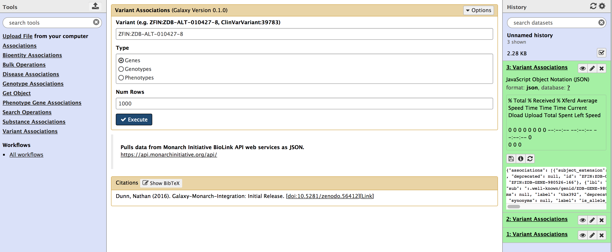

# Biolink-planteome

Wrapper around the [Planteome Biolink API](http://biolink.planteome.org/api/). 

Available on the [Galaxy Toolshed](https://toolshed.g2.bx.psu.edu/repository?repository_id=6a4f55387fe48fbd).

The [Planteome](http://planteome.org/) is a warehouse that integrates, aligns, and re-distributes cross-species gene, genotype, variant, disease, and phenotype data using ontology associations.

The [Biolink API](https://github.com/biolink/biolink-api) is an open API  biologically and biomedically relevant entities, and the relationships between them.

